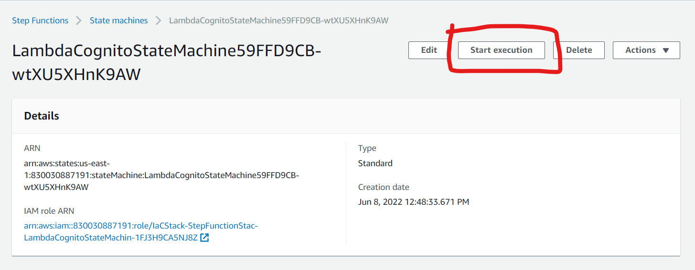
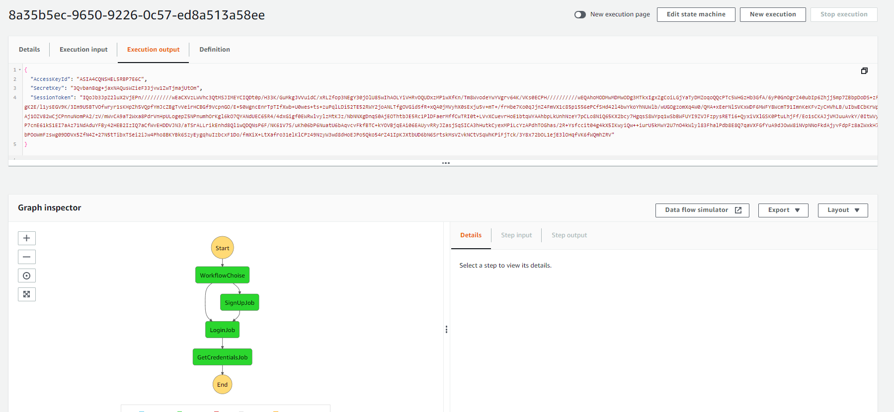
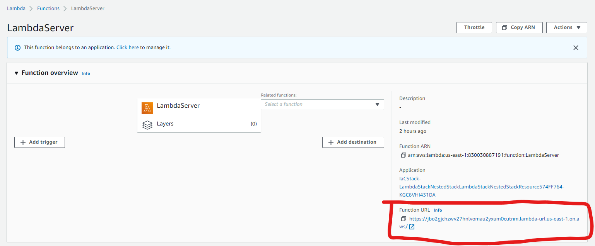
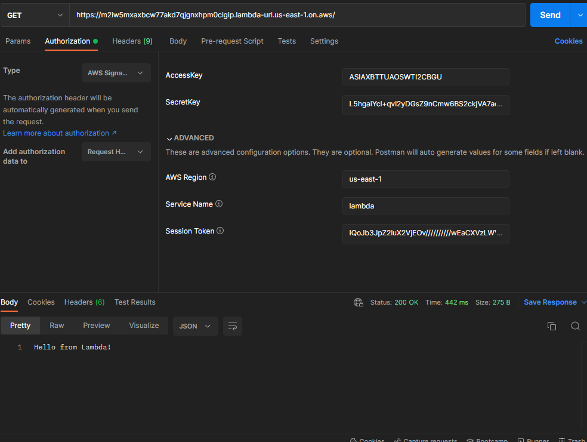
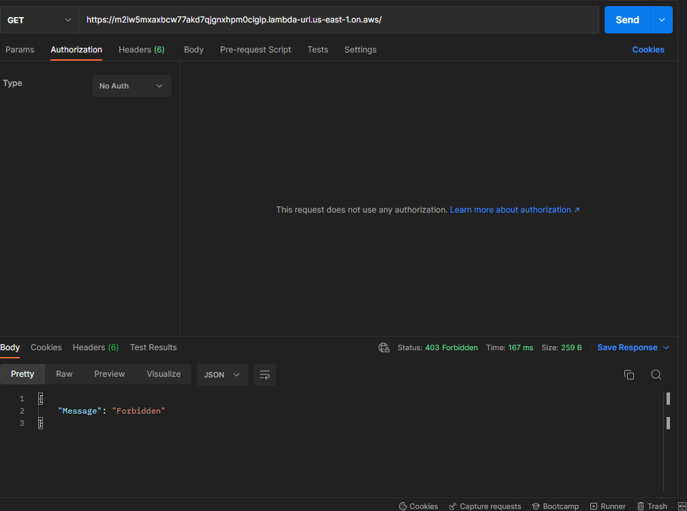

# LambdaURLCognito

## Overview
Lambda Function URLs are a feature of AWS Lambda that allows the invocation of a Lambda function
via HTTPS request without the need of any other AWS service to handle the request (usually this was done with Amazon API Gateway).
Lambda URLs come with two AuthTypes (NONE and IAM_USER), with NONE everyone with the endpoint can make requests and 
with IAM_USER the Lambda is only invoked if the request have an IAM User or Role credentials which has an ALLOW policy to invoke
that Lambda function


The main objective of this project is to test and demonstrate how Cognito authenticated 
users could assume an IAM Role and pass those credentials on the Lambda URL HTTPS request to invoke it.


### Prerequisites
- python 3.9.x with pip
- aws cli - [link](https://aws.amazon.com/cli/) (you should have it configured with credentials that have access to create all the resources - check this [guide](https://docs.aws.amazon.com/cli/latest/userguide/cli-chap-configure.html) to configure the CLI)
- aws cdk [link](https://docs.aws.amazon.com/cdk/v2/guide/home.html) - versao 2.25.0 (build ae1cb4b)
- AWS Account [link](https://aws.amazon.com/)


### Setup the environment
#### Go to IaC folder (all the commands bellow should be executed on the IaC folder)
```shell
cd IaC
```

#### Create .env file with the AWS Account Id and Region to deploy the infra
example of .env file:

```dotenv
CDK_DEFAULT_ACCOUNT="123456789012"
CDK_DEFAULT_REGION="us-east-1"
```

#### Setup python virtual environment for the CDK
```shell
python -m venv .venv
.venv\Scripts\activate
pip install -r requirements.txt
```

#### Bootstrap the environment 
```shell
cdk bootstrap
```
(for more information on why you have to do this check this [link](https://docs.aws.amazon.com/cdk/v2/guide/bootstrapping.html))


#### Deploy the infra
```shell
run cdk deploy
```


### Test using Step Functions Console

#### Start execution
Open LambdaCognitoStateMachine via console and click "Start Execution"


#### Set the input parameters
```json5
{
  "action": "signup", //or "login"
  "username": "NAME",
  "password": "PASSWORD" // should be compliant with Cognito password policy
}
```

#### Get credentials on the execution output



#### Using Postman to make the request:
- Grab credentials (AccessKey, SecretKey and Session) from Step Functions execution
- Grab LambdaServer function URL endpoint (from the LambdaServer on Lambda Console)

- Pass credentials on Postman and send the request

Result with credentials:


Result without credentials:
